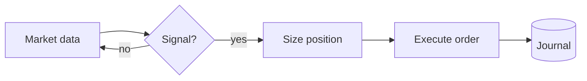
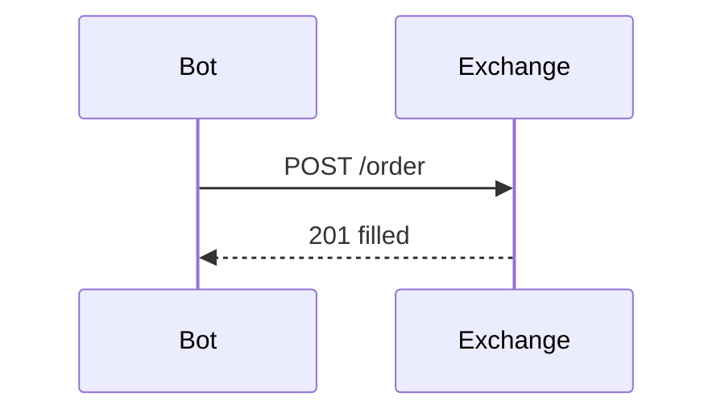

This post is a reference for writing. Delete it whenever you want.

## Text

Regular paragraphs, **bold**, *italic*, `inline code`, [links](https://enzo-m.fr) and footnotes[^1].

> Blockquotes look like this.

- Lists
- work
  - as expected

| Column | Another | Numbers |
| ------ | ------- | ------: |
| a      | b       |    1.00 |
| c      | d       |   42.00 |

## Math

Inline: the Sharpe ratio is $S = \frac{\mathbb{E}[R_p - R_f]}{\sigma_p}$.

Block:

$$
\hat{\beta} = (X^\top X)^{-1} X^\top y
\qquad
f(x) = \int_{-\infty}^{\infty} \hat{f}(\xi)\, e^{2\pi i \xi x}\, d\xi
$$

## Diagrams (Mermaid)





## Inline SVG

MDX files accept raw SVG. Use `currentColor` and `var(--accent)` so it follows light/dark mode:

<figure>
  <svg viewBox="0 0 400 120" role="img" aria-label="A sine wave">
    <line x1="0" y1="60" x2="400" y2="60" stroke="var(--border)" />
    <path d="M0 60 Q 50 0 100 60 T 200 60 T 300 60 T 400 60" fill="none" stroke="var(--accent)" strokeWidth="2" />
    <circle cx="100" cy="60" r="4" fill="currentColor" />
  </svg>
  <figcaption>An inline SVG that follows the theme.</figcaption>
</figure>

Or a file from `public/`: ``.

## Code

```python
def sharpe(returns, rf=0.0):
    excess = returns - rf
    return excess.mean() / excess.std(ddof=1)
```

```bash
npm run dev   # preview at http://localhost:4321
```

[^1]: Footnotes are rendered at the bottom.
